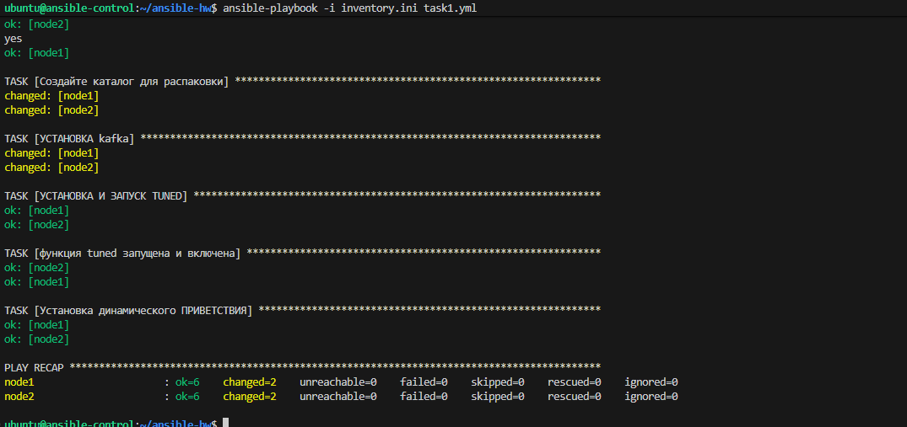
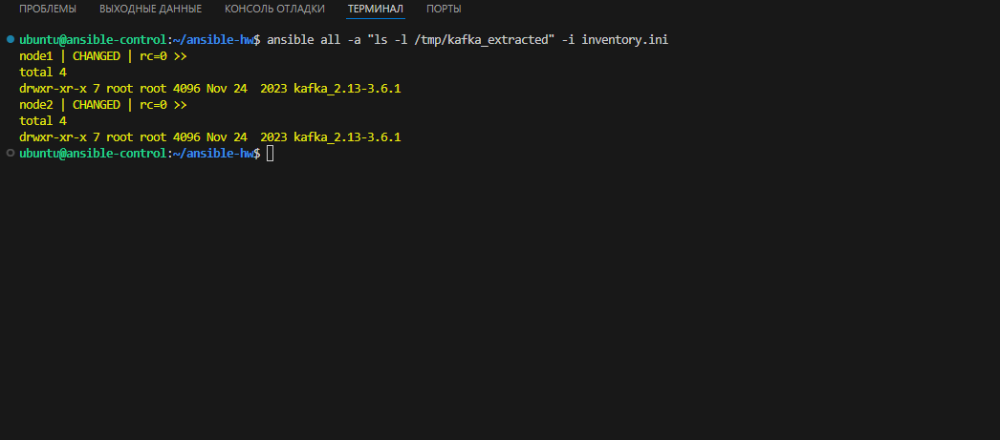
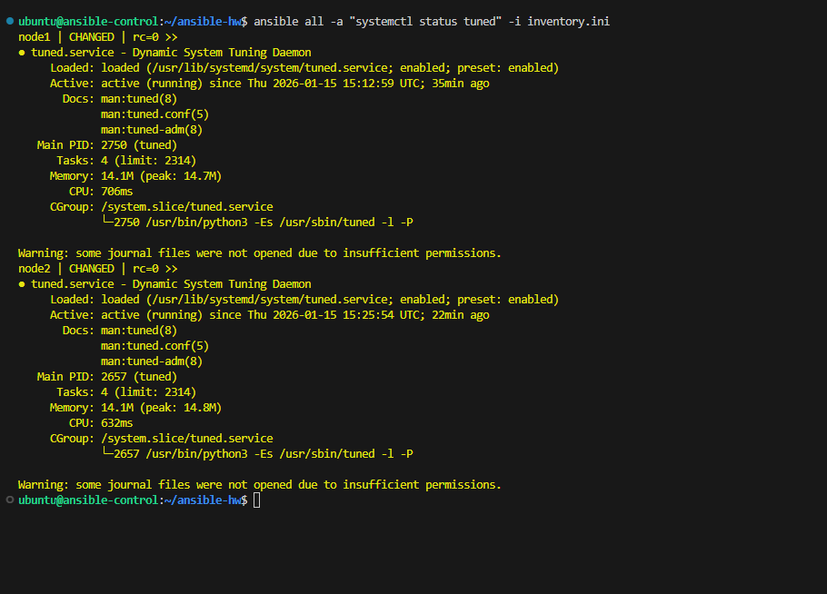

# Домашнее задание по Ansible: Автоматизация конфигурации серверов

В данном репозитории представлены решения трех задач по настройке управляемых узлов с использованием Ansible.

---

## Задание 1: Базовая автоматизация (`task1.yml`)

Этот сценарий выполняет начальную настройку системного окружения и установку необходимого ПО.

* **Архив (1.1):** Использование модуля `unarchive` для развертывания **Apache Kafka**. Благодаря параметру `remote_src: yes`, скачивание дистрибутива происходит напрямую на целевой сервер, что экономит трафик контроллера.
* **Пакет Tuned (1.2):** Установка и активация сервиса `tuned` для динамической оптимизации системы. Модуль `service` гарантирует состояние `started` и автозагрузку `enabled`.
* **Приветствие (1.3):** Создание статического файла `/etc/motd` с приветствием.

### Результат выполнения Задания 1



### Проверка состояния системы
Для подтверждения корректности установки были выполнены следующие проверки:

1. **Список файлов Kafka:**
\`\`\`bash
ansible all -a "ls -l /tmp/kafka_extracted" -i inventory.ini
\`\`\`


2. **Статус сервиса Tuned:**
\`\`\`bash
ansible all -a "systemctl status tuned" -i inventory.ini
\`\`\`


## Задание 2: Динамическое приветствие (`task1.yml`)

В этой части статическое приветствие заменено на динамическое с использованием системных фактов (**Ansible Facts**).

**Суть изменений:**
Плейбук собирает информацию о хосте и подставляет её в файл `/etc/motd`:
* `{{ ansible_hostname }}` — сетевое имя сервера.
* `{{ ansible_default_ipv4.address }}` — IP-адрес управления.

**Фрагмент кода:**
```yaml
- name: Установка динамического приветствия
  copy:
    content: |
      Welcome to server {{ ansible_hostname }}!
      Your IP address is {{ ansible_default_ipv4.address }}.
      Have a great day, System Administrator!
    dest: /etc/motd